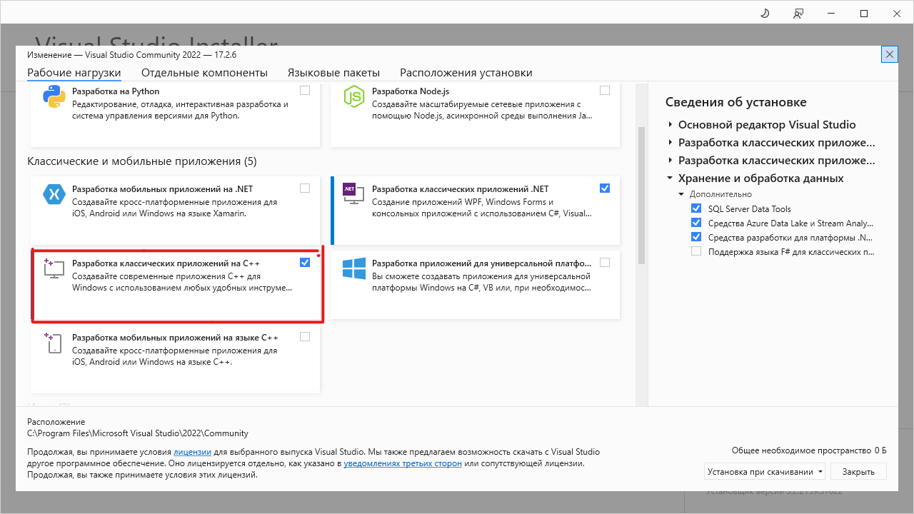

# Решение квадратного уравнения

Программа запаршивает у пользователя коэффициенты уравнения, записывает их в файл koefs.txt. Решает его, и записывает дискриминант, корни уравнения (если они есть) в файл answer.txt.

## Необходимые условия

Необходимо иметь файл с проектом и *Visual Studio 2022* с пакетом **Разработка классических приложений на C++**
 

## Установка
- Скачать архив проекта (https://github.com/fixiqq/File_C)
- Распаковать архив
- Открыть папку в Visual Studio 2022 и запустить проект (F5)

После этого в папке проекта появится папка *x64/Debug*  в которой находится файл *Project4.exe*. Для работы программы нет необходимости каждый раз запускать *Visual Studio 2022*. Достаточно работать с программой при помощи *.exe* файла. Скопируйте его из папки Debug в необходимое вам место. Файлы с коэфициентами и ответом будут создавать в папке, где хранится *.exe* файл.

## Технологии в проекте
Используемые библиотеки подключаются с помощью заголовочного файла *Header.h* 

    #pragma once
    #define _CRT_SECURE_NO_WARNINGS
    #include <stdio.h>
    #include <math.h>
    #include <locale.h>
    #include <stdlib.h>
    #define MIN -300
    #define MAX 300
    void QuadraticEquation(float a, float b, float c, FILE* file);

## Авторы
1. Сергей Альбертович
   * Сергей Калентьев
2. АЛЕКСЕЙ
    * Алексей Ермолаев
